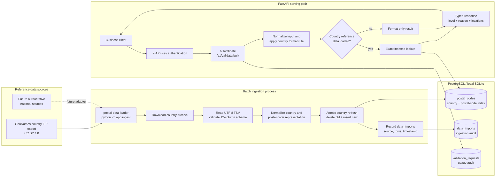
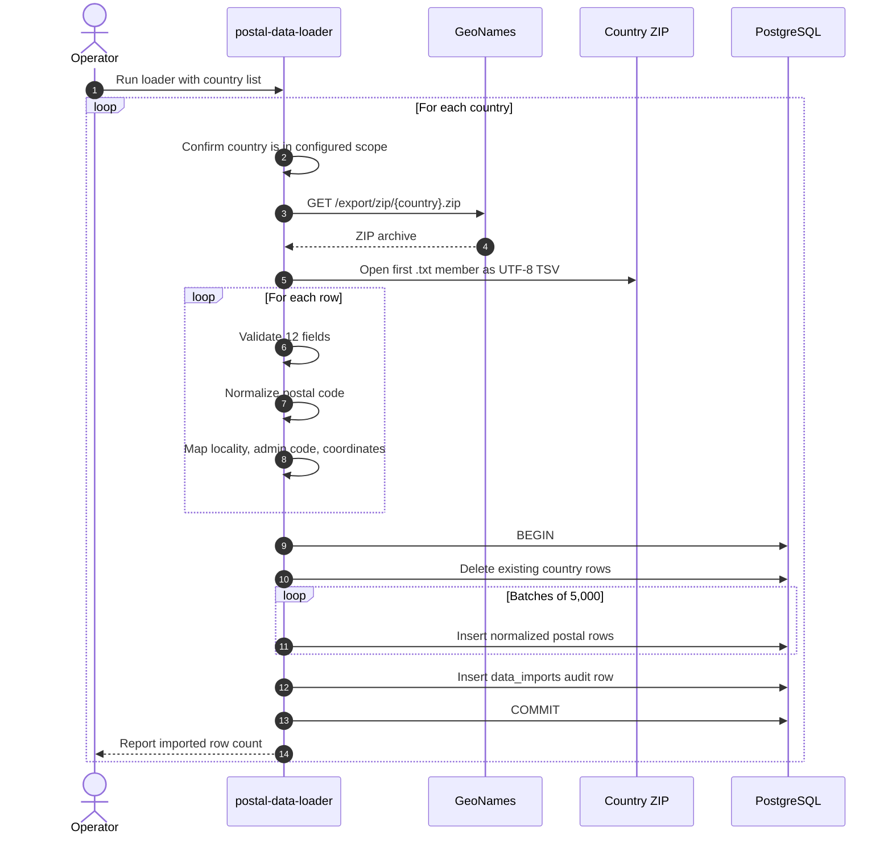
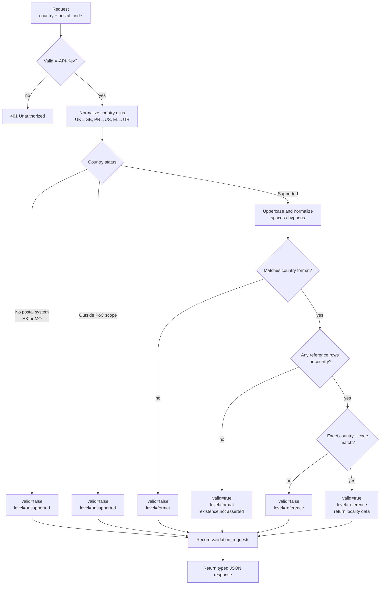
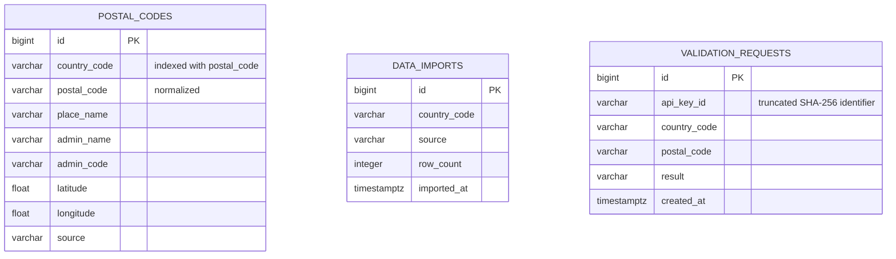
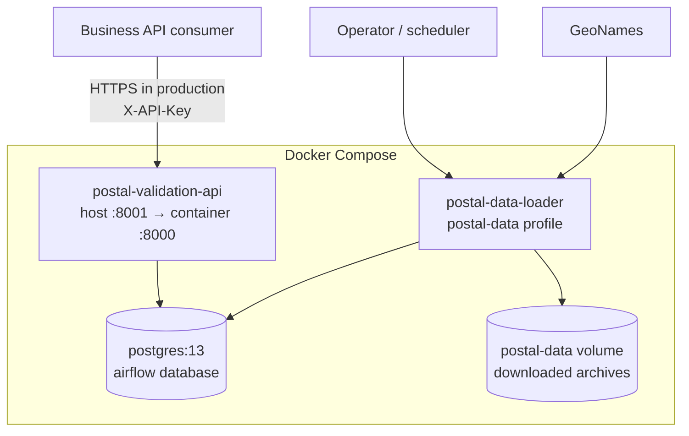

# Postal Validation: Ingestion to API Serving

This document shows how external postal reference data becomes an authenticated
validation response. The service always identifies whether a result came from a
format rule or an exact reference-data lookup.

## End-to-end architecture



## Ingestion sequence

The loader processes each requested ISO alpha-2 country independently. A failed
country transaction rolls back without deleting its previously loaded data.



Run it through Compose:

```bash
docker compose --profile postal-data run --rm postal-data-loader US CA GB DE
```

To use archives already stored in the `postal-data` volume:

```bash
docker compose --profile postal-data run --rm postal-data-loader \
  --no-download US CA
```

## API validation decision flow



### Example response before reference data is loaded

```json
{
  "country": "CA",
  "postal_code": "K1A 0B1",
  "valid": true,
  "validation_level": "format",
  "reason": "Format is valid; reference data is not loaded for this country",
  "locations": []
}
```

### Example response after reference data is loaded

```json
{
  "country": "CA",
  "postal_code": "K1A 0B1",
  "valid": true,
  "validation_level": "reference",
  "reason": "Found in reference data",
  "locations": [
    {
      "place_name": "Ottawa",
      "admin_name": "Ontario",
      "admin_code": "ON",
      "latitude": 45.4207,
      "longitude": -75.7023
    }
  ]
}
```

## Data model



`data_imports` and `validation_requests` are audit tables; they intentionally do
not own postal rows through foreign keys. Country refreshes can therefore
replace reference rows without removing historical import or request records.

## Deployment view



The PoC reuses the repository's PostgreSQL container. Production should use
managed migrations, tenant-owned hashed credentials, request quotas, source
freshness monitoring, and a scheduler for country refreshes.
